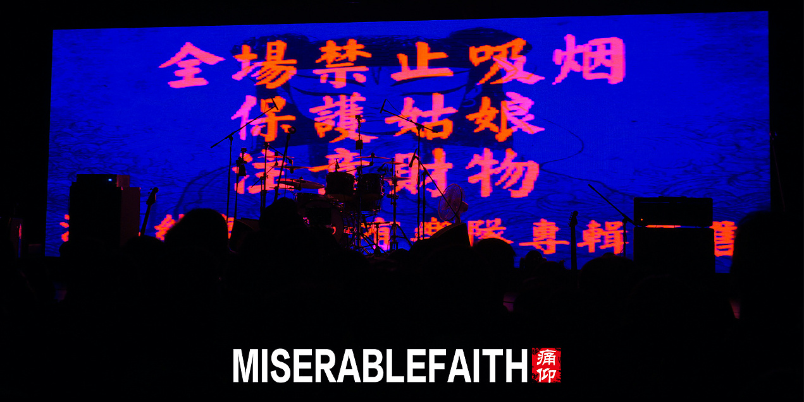

# Harbeth



[](https://github.com/yangKJ/Harbeth)
[](https://cocoapods.org/pods/Harbeth)
[](https://cocoapods.org/pods/OpencvQueen)

 
[**Harbeth**](https://github.com/yangKJ/Harbeth) 是 Apple 的 Metal 框架上的一小部分实用程序和扩展，专用于使您的 Swift GPU 代码更加简洁，让您更快地构建管道原型。

<font color=red>**图形处理和滤镜制作。👒👒👒**</font>

-------

[**English**](README.md) | 简体中文

## 功能清单
 🟣 目前，[**Metal Moudle**](https://github.com/yangKJ/Harbeth) 最重要的特点可以总结如下：

- 支持运算符函数式操作
- 支持快速设计滤镜
- 支持合并多种滤镜效果
- 支持输出源的快速扩展
- 支持相机采集特效
- 支持视频添加滤镜特效
- 支持矩阵卷积
- 滤镜部分大致分为以下几个模块：
   - [x] [Blend](https://github.com/yangKJ/Harbeth/tree/master/Sources/Compute/Blend)：图像融合技术
   - [x] [Blur](https://github.com/yangKJ/Harbeth/tree/master/Sources/Compute/Blur)：模糊效果
   - [x] [ColorProcess](https://github.com/yangKJ/Harbeth/tree/master/Sources/Compute/ColorProcess)：图像的基本像素颜色处理
   - [x] [Effect](https://github.com/yangKJ/Harbeth/tree/master/Sources/Compute/Effect)：效果处理
   - [x] [Lookup](https://github.com/yangKJ/Harbeth/tree/master/Sources/Compute/Lookup)：查找表过滤器
   - [x] [Matrix](https://github.com/yangKJ/Harbeth/tree/master/Sources/Compute/Matrix): 矩阵卷积滤波器
   - [x] [Shape](https://github.com/yangKJ/Harbeth/tree/master/Sources/Compute/Shape)：图像形状大小相关
   - [x] [VisualEffect](https://github.com/yangKJ/Harbeth/tree/master/Sources/Compute/VisualEffect): 视觉动态特效

#### **总结下来目前共有 `100+` 种滤镜供您使用。✌️**

<p align="left">


</p>

- 代码零侵入注入滤镜功能，

```swift
原始代码：
ImageView.image = originImage

注入滤镜代码：
let filter = C7ColorMatrix4x4(matrix: Matrix4x4.sepia)
var filter2 = C7Granularity()
filter2.grain = 0.8
var filter3 = C7SoulOut()
filter3.soul = 0.7
let filters = [filter, filter2, filter3]

简单使用
ImageView.image = try? originImage.makeGroup(filters: filters)

或者运算符操作
let AT = C7FilterTexture.init(texture: originImage.mt.toTexture()!)
let result = AT ->> filter ->> filter2 ->> filter3
ImageView.image = result.outputImage()

甚至函数式编程高级用法
var texture = originImage.mt.toTexture()!
filters.forEach { texture = texture ->> $0 }
ImageView.image = texture.toImage()
```

- 相机采集生成图片

```swift
注入边缘检测滤镜:
var filter = C7EdgeGlow()
filter.lineColor = UIColor.red

注入颗粒感滤镜:
var filter2 = C7Granularity()
filter2.grain = 0.8

生成相机采集器:
let collector = C7FilterCollector(callback: { [weak self] (image) in
    self?.ImageView.image = image
})
ImageView.layer.addSublayer(collector) // 这句必须要，
collector.captureSession.sessionPreset = AVCaptureSession.Preset.hd1280x720
collector.groupFilters = [filter, filter2]
```

### 主要部分
- 核心，基础核心板块
    - [C7FilterProtocol](https://github.com/yangKJ/Harbeth/blob/master/Sources/Basic/Core/C7FilterProtocol.swift)：滤镜设计必须遵循此协议
        - **modifier**：编码器类型和对应的函数名称
        - **factors**：设置修改参数因子，需要转换为`Float`
        - **otherInputTextures**：多个输入源，包含`MTLTexture`的数组
        - **outputSize**：更改输出图像的大小

- 输出，输出板块
	- [C7FilterDestProtocol](https://github.com/yangKJ/Harbeth/blob/master/Sources/Basic/Outputs/C7FilterDestProtocol.swift)：输出内容协议，所有输出都必须实现该协议
	    - **make**：根据滤镜处理生成数据
	    - **makeGroup**：多个滤镜组合，请注意滤镜添加的顺序可能会影响图像生成的结果
	- [C7FilterImage](https://github.com/yangKJ/Harbeth/blob/master/Sources/Basic/Outputs/C7FilterImage.swift)：基于C7FilterDestProtocol的图像输入源，以下模式仅支持基于并行计算的编码器
	- [C7FilterTexture](https://github.com/yangKJ/Harbeth/blob/master/Sources/Basic/Outputs/C7FilterTexture.swift): 基于C7FilterDestProtocol的纹理输入源，输入纹理转换成滤镜处理纹理
	- [C7FilterCollector](https://github.com/yangKJ/Harbeth/blob/master/Sources/Basic/Outputs/C7FilterCollector.swift)：相机数据采集器，生成Layer，然后在主线程返回图片

### 设计滤镜
- 举个例子，如何设计一款灵魂出窍滤镜🎷

<p align="left">

</p>

1. 遵循协议 `C7FilterProtocal`

	```swift
    public protocol C7FilterProtocol {
        /// 编码器类型和对应的函数名
        ///
        /// 计算需要对应的`kernel`函数名
        /// 渲染需要一个`vertex`着色器函数名和一个`fragment`着色器函数名
        var modifier: Modifier { get }
            
        /// 制作缓冲区
        /// 设置修改参数因子，需要转换为`Float`。
        var factors: [Float] { get }
            
        /// 多输入源扩展
        /// 包含 `MTLTexture` 的数组
        var otherInputTextures: C7InputTextures { get }
            
        /// 改变输出图像的大小
        func outputSize(input size：C7Size) -> C7Size
    }
	```

2. 配置额外的所需纹理

3. 配置传递参数因子，仅支持`Float`类型
    - 这款滤镜主要需要三个参数：
		- `soul`：调整后的灵魂，从 0.0 到 1.0，默认为 0.5
		- `maxScale`：最大灵魂比例
		- `maxAlpha`：最大灵魂的透明度

4. 编写基于并行计算的核函数着色器

	```metal
	kernel void C7SoulOut(texture2d<half, access::write> outputTexture [[texture(0)]],
	                      texture2d<half, access::sample> inputTexture [[texture(1)]],
	                      constant float *soulPointer [[buffer(0)]],
	                      constant float *maxScalePointer [[buffer(1)]],
	                      constant float *maxAlphaPointer [[buffer(2)]],
	                      uint2 grid [[thread_position_in_grid]]) {
	    constexpr sampler quadSampler(mag_filter::linear, min_filter::linear);
	    const half4 inColor = inputTexture.read(grid);
	    const float x = float(grid.x) / outputTexture.get_width();
	    const float y = float(grid.y) / outputTexture.get_height();
	    
	    const half soul = half(*soulPointer);
	    const half maxScale = half(*maxScalePointer);
	    const half maxAlpha = half(*maxAlphaPointer);
	    
	    const half alpha = maxAlpha * (1.0h - soul);
	    const half scale = 1.0h + (maxScale - 1.0h) * soul;
	    
	    const half soulX = 0.5h + (x - 0.5h) / scale;
	    const half soulY = 0.5h + (y - 0.5h) / scale;
	    
	    const half4 soulMask = inputTexture.sample(quadSampler, float2(soulX, soulY));
	    const half4 outColor = inColor * (1.0h - alpha) + soulMask * alpha;
	    
	    outputTexture.write(outColor, grid);
	}
	```

5. 简单使用，由于我这边设计的是基于并行计算管道，所以可以直接生成图片

	```swift
	var filter = C7SoulOut()
	filter.soul = 0.5
	filter.maxScale = 2.0
	
	/// Display directly in ImageView
	ImageView.image = try? originImage.make(filter: filter)
	```

6. 至于上面的动效也很简单，添加一个计时器，然后改变`soul`值就完事，简单嘛 0 0.

----

### 高级用法

<p align="left">

</p>

- 运算符链式处理

```swift
/// 1.转换成BGRA
let filter1 = C7ColorConvert(with: .color2BGRA)

/// 2.调整颗粒度
var filter2 = C7Granularity()
filter2.grain = 0.8

/// 3.调整白平衡
var filter3 = C7WhiteBalance()
filter3.temperature = 5555

/// 4.调整高光阴影
var filter4 = C7HighlightShadow()
filter4.shadows = 0.4
filter4.highlights = 0.5

/// 5.组合操作
let AT = C7FilterTexture.init(texture: originImage.mt.toTexture()!)
let result = AT ->> filter1 ->> filter2 ->> filter3 ->> filter4

/// 6.获取结果
filterImageView.image = result.outputImage()
```

-----

<p align="left">

</p>

- 组合操作

```swift
/// 1.转换成RBGA
let filter1 = C7ColorConvert(with: .color2RBGA)

/// 2.调整颗粒度
var filter2 = C7Granularity()
filter2.grain = 0.8

/// 3.配置灵魂效果
var filter3 = C7SoulOut()
filter3.soul = 0.7

/// 4.组合操作
let group: [C7FilterProtocol] = [filter1, filter2, filter3]

/// 5.获取结果
filterImageView.image = try? originImage.makeGroup(filters: group)
```

**两种方式都可以处理多滤镜方案，怎么选择就看你心情。✌️**

----

### 相机采集特效


### CocoaPods Install

- 如果要导入 [Metal](https://github.com/yangKJ/Harbeth) 模块，则需要在 Podfile 中：

```
pod 'Harbeth'
```

- 如果要导入 [**OpenCV**](https://github.com/yangKJ/OpencvQueen) 图像模块，则需要在 Podfile 中：

```
pod 'OpencvQueen'
```

### 关于作者
- 🎷 **邮箱地址：[ykj310@126.com](ykj310@126.com) 🎷**
- 🎸 **GitHub地址：[yangKJ](https://github.com/yangKJ) 🎸**
- 🎺 **掘金地址：[茶底世界之下](https://juejin.cn/user/1987535102554472/posts) 🎺**
- 🚴🏻 **简书地址：[77___](https://www.jianshu.com/u/c84c00476ab6) 🚴🏻**

----

> <font color=red>**觉得有帮助的老哥们，请帮忙点个星 ⭐..**</font>

**救救孩子吧，谢谢各位老板。**

🥺

-----
